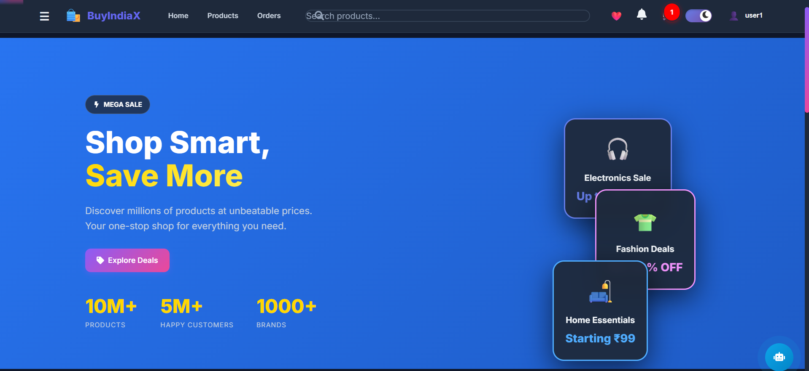
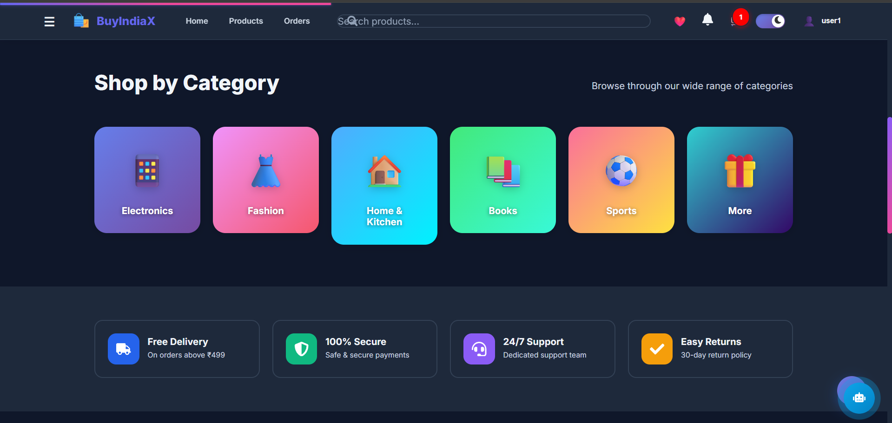
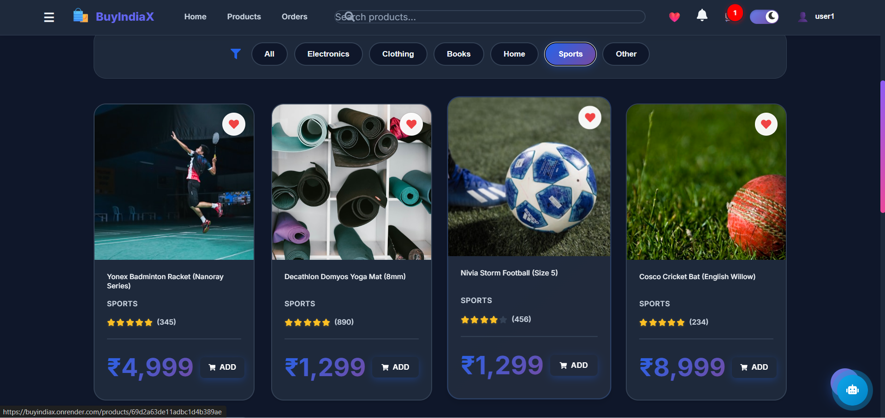
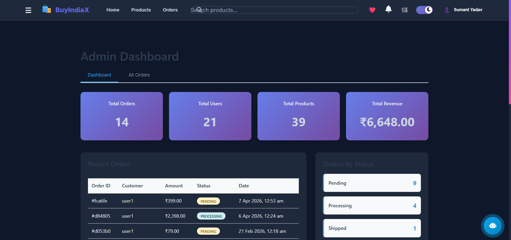

# 🛍️ BuyIndiaX - Enterprise E-Commerce Platform

A full-stack, production-ready e-commerce platform built with the MERN stack, featuring real-time notifications, AI-powered recommendations, and enterprise-grade security.

[](LICENSE)

## 🌐 Live Demo

**[Visit BuyIndiaX →](https://buyindiax.onrender.com/)**

Experience the full-featured e-commerce platform in action!

## 📸 Screenshots

### Home Page


### Shop by Category


### Product Page


### Admin Dashboard


## 🚀 Features

### Core Features
- 🛒 **Complete E-Commerce Flow** - Browse, cart, checkout, payment, order tracking
- 💳 **Payment Integration** - Razorpay payment gateway with test mode
- 🔐 **Authentication & Authorization** - JWT-based auth with role-based access
- 📦 **Order Management** - Real-time order tracking with timeline visualization
- ⭐ **Reviews & Ratings** - Product reviews with image upload support
- ❤️ **Wishlist** - Save favorite products
- 🔍 **Advanced Search** - Autocomplete with search history and suggestions
- 🎯 **Product Comparison** - Side-by-side product comparison

### Advanced Features
- 🤖 **AI Chatbot** - Google Gemini AI-powered customer support
- 🔔 **Real-Time Notifications** - Socket.IO for instant updates
- 📊 **Analytics Dashboard** - Sales, revenue, and user behavior tracking
- 🎁 **Coupon System** - Discount codes and promotional offers
- 🏆 **Loyalty Program** - Points system with tiered memberships
- 📈 **Recommendation Engine** - Collaborative filtering for personalized suggestions
- 🌓 **Dark/Light Theme** - Smooth theme switching with persistence
- 📱 **Fully Responsive** - Mobile-first design

### Admin Features
- 📊 **Admin Dashboard** - Real-time analytics and insights
- 📦 **Product Management** - CRUD operations with bulk CSV import/export
- 👥 **Customer Management** - User analytics and segmentation
- 📋 **Order Management** - Status updates and order processing
- 📉 **Sales Analytics** - Visual charts and reports
- 🔔 **Low Stock Alerts** - Automated inventory notifications

## 🛠️ Tech Stack

### Backend
- **Runtime**: Node.js 18+
- **Framework**: Express.js
- **Database**: MongoDB with Mongoose ODM
- **Cache**: Redis (optional)
- **Authentication**: JWT (JSON Web Tokens)
- **Payment**: Razorpay
- **AI**: Google Gemini API
- **Real-time**: Socket.IO
- **Email**: Nodemailer

### Frontend
- **Framework**: React 19
- **Routing**: React Router v7
- **State Management**: Context API
- **Animations**: Framer Motion
- **Icons**: React Icons
- **HTTP Client**: Axios

### DevOps & Infrastructure
- **Containerization**: Docker & Docker Compose
- **Orchestration**: Kubernetes with Helm
- **Monitoring**: Prometheus & Grafana
- **CI/CD**: GitHub Actions
- **Security Scanning**: Trivy
- **Code Quality**: ESLint, SonarCloud
- **Auto-scaling**: Horizontal Pod Autoscaler

## 📋 Prerequisites

- Node.js 18+ and npm
- MongoDB 6.0+
- Docker & Docker Compose (for containerized deployment)
- Git

## 🚀 Quick Start

### 1. Clone Repository
```bash
git clone https://github.com/Sumant3086/BuyIndiaX.git
cd buyindiax
```

### 2. Install Dependencies
```bash
# Backend dependencies
npm install

# Frontend dependencies
cd client
npm install
cd ..
```

### 3. Environment Setup
```bash
# Copy example env file
cp .env.example .env

# Edit .env with your configuration
nano .env
```

Required environment variables:
```env
# Server
NODE_ENV=development
PORT=5000

# Database
MONGODB_URI=mongodb://localhost:27017/buyindiax

# JWT
JWT_SECRET=your_super_secret_jwt_key

# Razorpay (Test Keys)
RAZORPAY_KEY_ID=rzp_test_SZT2as0qsWZtkR
RAZORPAY_KEY_SECRET=uJLKwIAhb6JcXu2PWIoBzHhC

# Google AI
GOOGLE_API_KEY=your_google_api_key

# Email (Optional)
EMAIL_USER=your_email@gmail.com
EMAIL_PASS=your_app_password
```

### 4. Seed Database (Optional)
```bash
node scripts/seedProducts.js
```

### 5. Run Application

#### Development Mode:
```bash
# Start backend (port 5000)
npm run dev

# Start frontend (port 3000) - in another terminal
cd client
npm start
```

#### Production Mode:
```bash
# Build frontend
cd client
npm run build
cd ..

# Start server
npm start
```

#### Docker Mode:
```bash
# Start all services
docker-compose up -d

# View logs
docker-compose logs -f

# Stop services
docker-compose down
```

## 📚 Documentation

- **[Kubernetes Setup](KUBERNETES_SETUP.md)** - Complete Kubernetes deployment guide
- **[Helm Charts](helm/README.md)** - Simplified deployment with Helm
- **[Deployment Guide](DEPLOYMENT.md)** - Production deployment instructions
- **[CI/CD Setup](CI-CD-SETUP.md)** - GitHub Actions pipeline configuration
- **[Frontend Enhancements](FRONTEND_ENHANCEMENTS.md)** - UI/UX features documentation

## 🏗️ Project Structure

```
buyindiax/
├── client/                 # React frontend
│   ├── public/            # Static files
│   └── src/
│       ├── components/    # Reusable components
│       ├── context/       # Context providers
│       ├── pages/         # Page components
│       ├── theme/         # Theme & animations
│       └── utils/         # Utility functions
├── middleware/            # Express middleware
├── models/               # MongoDB models
├── routes/               # API routes
├── scripts/              # Utility scripts
├── utils/                # Backend utilities
├── .github/              # GitHub Actions workflows
├── docker-compose.yml    # Docker orchestration
├── Dockerfile           # Docker image definition
└── server.js            # Express server entry point
```

## 🔒 Security Features

- ✅ **JWT Authentication** - Secure token-based auth
- ✅ **Password Hashing** - bcrypt with salt rounds
- ✅ **Rate Limiting** - Per-user and IP-based limits
- ✅ **Input Sanitization** - XSS and NoSQL injection prevention
- ✅ **Security Headers** - Helmet.js with CSP
- ✅ **CORS Configuration** - Controlled cross-origin requests
- ✅ **SQL Injection Prevention** - Pattern detection
- ✅ **Secure Payment** - PCI-DSS compliant Razorpay integration

## 🎨 UI/UX Features

- ✨ **3D Animations** - Parallax scrolling and 3D transforms
- 🎭 **Glassmorphism** - Modern frosted glass effects
- 🌊 **Smooth Transitions** - Framer Motion animations
- 📱 **Mobile Responsive** - Touch-friendly interactions
- ♿ **Accessible** - ARIA labels and keyboard navigation
- 🎨 **Theme System** - Dark/light mode with smooth transitions
- ⚡ **Performance Optimized** - Code splitting and lazy loading

## 📊 API Endpoints

### Authentication
- `POST /api/auth/register` - User registration
- `POST /api/auth/login` - User login
- `GET /api/auth/me` - Get current user

### Products
- `GET /api/products` - Get all products
- `GET /api/products/:id` - Get product by ID
- `GET /api/products/search` - Search products
- `POST /api/products` - Create product (Admin)
- `PUT /api/products/:id` - Update product (Admin)
- `DELETE /api/products/:id` - Delete product (Admin)

### Orders
- `POST /api/orders` - Create order
- `GET /api/orders` - Get user orders
- `GET /api/orders/:id` - Get order by ID
- `PUT /api/orders/admin/:id/status` - Update order status (Admin)

### Cart
- `GET /api/cart` - Get user cart
- `POST /api/cart/add` - Add item to cart
- `PUT /api/cart/update/:id` - Update cart item
- `DELETE /api/cart/remove/:id` - Remove from cart

### Payment
- `POST /api/payment/create-order` - Create Razorpay order
- `POST /api/payment/verify` - Verify payment

[See full API documentation](docs/API.md)

## 🧪 Testing

```bash
# Run backend tests
npm test

# Run frontend tests
cd client
npm test

# Run with coverage
npm run test:coverage
```

## 🚢 Deployment

### Option 1: Docker Compose (Development)
```bash
# Build and start
docker-compose up -d

# View logs
docker-compose logs -f

# Stop
docker-compose down
```

### Option 2: Kubernetes (Production - Recommended)
```bash
# Quick deploy
cd k8s
chmod +x deploy.sh
./deploy.sh

# Or use Helm
helm install buyindiax ./helm/buyindiax -n buyindiax --create-namespace
```

See [KUBERNETES_SETUP.md](KUBERNETES_SETUP.md) for complete guide.

### Option 3: Manual Deployment
See [DEPLOYMENT.md](DEPLOYMENT.md) for detailed instructions.

### CI/CD Pipeline
Automated deployment via GitHub Actions. See [CI-CD-SETUP.md](CI-CD-SETUP.md).

## 🤝 Contributing

1. Fork the repository
2. Create your feature branch (`git checkout -b feature/AmazingFeature`)
3. Commit your changes (`git commit -m 'Add some AmazingFeature'`)
4. Push to the branch (`git push origin feature/AmazingFeature`)
5. Open a Pull Request

## 📝 License

This project is licensed under the MIT License - see the [LICENSE](LICENSE) file for details.

## 👨‍💻 Author

**Sumant**
- GitHub: [@Sumant3086](https://github.com/Sumant3086)
- LinkedIn: [Sumant](https://www.linkedin.com/in/sumant3086/)

## 🙏 Acknowledgments

- Razorpay for payment gateway
- Google for Gemini AI API
- MongoDB for database
- React team for amazing framework
- Framer Motion for animations

## 📞 Support

For support, email support@buyindiax.com or open an issue on GitHub.

---

**⭐ Star this repo if you find it helpful!**

Made with ❤️ by Sumant
